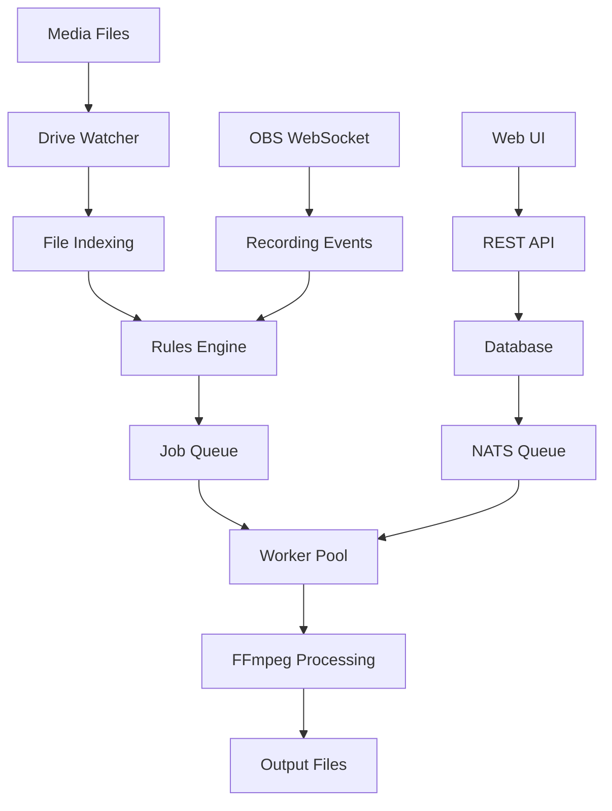
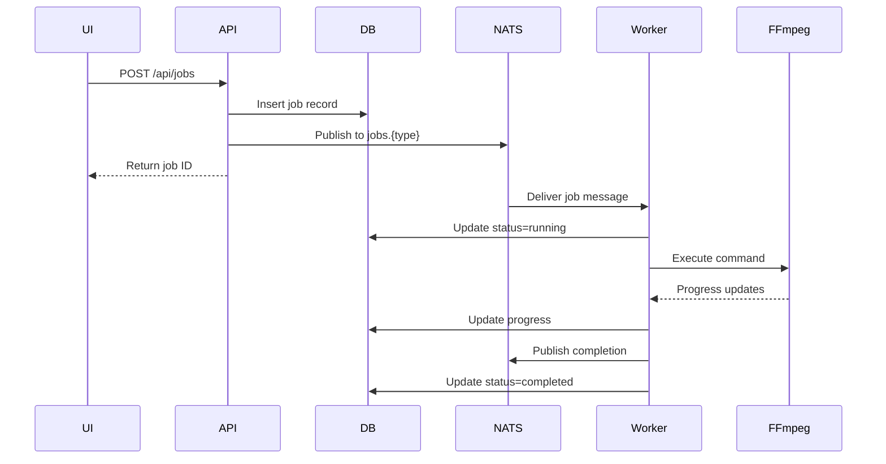

# StreamOps Technical Documentation
## Complete System Architecture & Implementation Guide

---

## Table of Contents

1. [System Overview](#system-overview)
2. [Architecture](#architecture)
3. [Technology Stack](#technology-stack)
4. [Project Structure](#project-structure)
5. [Core Components](#core-components)
6. [Database Schema](#database-schema)
7. [API Endpoints](#api-endpoints)
8. [Frontend Architecture](#frontend-architecture)
9. [Job Processing System](#job-processing-system)
10. [Rules Engine](#rules-engine)
11. [Media Processing Pipeline](#media-processing-pipeline)
12. [Configuration System](#configuration-system)
13. [Deployment & Operations](#deployment-operations)
14. [Development Workflow](#development-workflow)
15. [Security & Authentication](#security-authentication)

---

## System Overview

StreamOps is a containerized media pipeline automation platform designed for content creators and streamers. It provides automated media processing, asset management, and workflow automation through a modern web interface.

### Key Features

- **Automated Media Processing**: Remuxing, transcoding, proxy generation, thumbnail creation
- **Asset Management**: File indexing, metadata extraction, full-text search
- **Workflow Automation**: Rule-based processing with conditions and actions
- **Real-time Monitoring**: System stats, job tracking, resource usage
- **OBS Integration**: WebSocket control, recording detection, overlay management
- **Multi-drive Support**: Watch folders across multiple drives with hot-plug support

### System Flow



---

## Architecture

### High-Level Architecture

```
┌─────────────────────────────────────────────────────────────┐
│                        Docker Container                      │
├─────────────────────────────────────────────────────────────┤
│  ┌─────────────┐  ┌─────────────┐  ┌─────────────┐        │
│  │   Nginx     │  │   React UI  │  │   FastAPI   │        │
│  │   (Static)  │  │   (Built)   │  │   (API)     │        │
│  └─────────────┘  └─────────────┘  └─────────────┘        │
│         │                │                 │                │
│  ┌──────────────────────────────────────────────┐          │
│  │               s6-overlay supervisor          │          │
│  └──────────────────────────────────────────────┘          │
│         │                │                 │                │
│  ┌─────────────┐  ┌─────────────┐  ┌─────────────┐        │
│  │   Worker    │  │    NATS     │  │   SQLite    │        │
│  │   Process   │  │   JetStream │  │   Database  │        │
│  └─────────────┘  └─────────────┘  └─────────────┘        │
└─────────────────────────────────────────────────────────────┘
```

### Component Communication

- **Frontend ↔ API**: REST over HTTP/HTTPS
- **API ↔ Database**: aiosqlite async connections
- **API ↔ Queue**: NATS JetStream pub/sub
- **Worker ↔ Queue**: NATS consumer groups
- **API ↔ OBS**: WebSocket protocol
- **Frontend ↔ API**: Optional WebSocket for real-time updates

---

## Technology Stack

### Backend
```python
# Core Framework
FastAPI==0.115.6        # Async REST API framework
uvicorn==0.34.0         # ASGI server
pydantic==2.10.4        # Data validation

# Database
aiosqlite==0.20.0       # Async SQLite driver
alembic==1.14.0         # Database migrations

# Queue & Messaging
nats-py==2.10.0         # NATS client
asyncio-nats-streaming==0.4.0  # NATS Streaming

# Media Processing
av==12.3.0              # Python bindings for FFmpeg
scenedetect==0.6.5      # Scene detection
Pillow==11.1.0          # Image processing

# System Monitoring
psutil==6.1.1           # System stats
watchdog==6.0.0         # File system monitoring
```

### Frontend
```javascript
// Core Framework
React 18.2              // UI framework
Vite 5.0                // Build tool
React Router 6          // Client-side routing

// State Management
@tanstack/react-query   // Server state
Zustand                 // Client state

// UI Components
Tailwind CSS 3.4        // Utility-first CSS
Radix UI                // Headless components
Lucide React            // Icon library

// Utilities
Axios                   // HTTP client
date-fns                // Date formatting
React Hot Toast         // Notifications
```

### Infrastructure
```dockerfile
# Base Images
python:3.11-slim        # Python runtime
node:20-alpine          # Node.js for build

# Process Management
s6-overlay 3.2.0.2      # Process supervisor

# External Tools
ffmpeg                  # Media processing
nats-server             # Message queue
sqlite3                 # Database
```

---

## Project Structure

```
/mnt/d/Projects/streamops/
├── app/
│   ├── api/                    # FastAPI backend
│   │   ├── main.py            # Application entry point
│   │   ├── routers/           # API endpoints
│   │   │   ├── assets.py      # Asset management
│   │   │   ├── jobs.py        # Job queue management
│   │   │   ├── rules.py       # Automation rules
│   │   │   ├── drives.py      # Drive monitoring
│   │   │   ├── reports.py     # Report generation
│   │   │   ├── system.py      # System monitoring
│   │   │   └── config.py      # Configuration
│   │   ├── schemas/           # Pydantic models
│   │   │   ├── assets.py      # Asset data models
│   │   │   ├── jobs.py        # Job data models
│   │   │   └── rules.py       # Rule data models
│   │   ├── services/          # Business logic
│   │   │   ├── rules_engine.py    # Rule evaluation
│   │   │   ├── nats_service.py    # Queue management
│   │   │   ├── obs_service.py     # OBS integration
│   │   │   └── config_service.py  # Config management
│   │   └── db/
│   │       └── database.py    # Database setup
│   │
│   ├── worker/                # Background workers
│   │   ├── main.py           # Worker entry point
│   │   ├── jobs/             # Job processors
│   │   │   ├── base.py       # Base job class
│   │   │   ├── remux.py      # Remux processor
│   │   │   ├── transcode.py  # Transcode processor
│   │   │   ├── thumbnail.py  # Thumbnail generator
│   │   │   └── proxy.py      # Proxy creator
│   │   └── watchers/         # File watchers
│   │       └── drive_watcher.py
│   │
│   ├── ui/                   # React frontend
│   │   ├── src/
│   │   │   ├── App.jsx       # Main app component
│   │   │   ├── pages/        # Page components
│   │   │   │   ├── Dashboard.jsx
│   │   │   │   ├── Assets.jsx
│   │   │   │   ├── Jobs.jsx
│   │   │   │   ├── Rules.jsx
│   │   │   │   └── Settings.jsx
│   │   │   ├── hooks/        # Custom React hooks
│   │   │   │   ├── useApi.js
│   │   │   │   ├── useAssets.js
│   │   │   │   ├── useJobs.js
│   │   │   │   └── useSystem.js
│   │   │   ├── components/   # Reusable components
│   │   │   └── services/     # API services
│   │   └── dist/            # Built static files
│   │
│   └── pkg/                  # Docker/deployment
│       ├── services.d/       # s6 service definitions
│       └── cont-init.d/      # Container init scripts
│
├── docker-compose.yml        # Docker composition
├── Dockerfile               # Container definition
├── requirements.txt         # Python dependencies
└── package.json            # Node dependencies
```

---

## Core Components

### 1. API Gateway (FastAPI)

**Location**: `/app/api/main.py`

The main API application that handles all HTTP requests and WebSocket connections.

```python
# app/api/main.py
from fastapi import FastAPI, WebSocket
from fastapi.middleware.cors import CORSMiddleware
from app.api.routers import assets, jobs, rules, system

app = FastAPI(title="StreamOps API", version="1.0.0")

# CORS configuration
app.add_middleware(
    CORSMiddleware,
    allow_origins=["*"],
    allow_methods=["*"],
    allow_headers=["*"],
)

# Include routers
app.include_router(assets.router, prefix="/api/assets")
app.include_router(jobs.router, prefix="/api/jobs")
app.include_router(rules.router, prefix="/api/rules")
app.include_router(system.router, prefix="/api/system")

# Startup event
@app.on_event("startup")
async def startup():
    await init_db()
    if os.getenv("NATS_ENABLE") == "true":
        await nats_service.connect()
```

### 2. Database Layer

**Location**: `/app/api/db/database.py`

SQLite database with async support and connection pooling.

```python
# app/api/db/database.py
import aiosqlite
from pathlib import Path

_db: Optional[aiosqlite.Connection] = None

async def get_db() -> aiosqlite.Connection:
    """Get database connection"""
    global _db
    if _db is None:
        await init_db()
    return _db

async def init_db():
    """Initialize database with schema"""
    global _db
    db_path = Path(os.getenv("DB_PATH", "/data/db/streamops.db"))
    db_path.parent.mkdir(parents=True, exist_ok=True)
    
    _db = await aiosqlite.connect(str(db_path))
    await _db.execute("PRAGMA foreign_keys = ON")
    await _db.execute("PRAGMA journal_mode = WAL")
    await create_tables()
```

### 3. Job Queue System

**Location**: `/app/api/services/nats_service.py`

NATS JetStream for durable job queuing and event streaming.

```python
# app/api/services/nats_service.py
import nats
from nats.js import JetStreamContext

class NATSService:
    def __init__(self):
        self.nc = None
        self.js = None
    
    async def connect(self):
        """Connect to NATS server"""
        self.nc = await nats.connect(
            servers=os.getenv("NATS_URL", "nats://localhost:4222")
        )
        self.js = self.nc.jetstream()
        
        # Create streams
        await self.js.add_stream(
            name="JOBS",
            subjects=["jobs.*"],
            retention="workqueue",
            max_msgs=10000,
            max_age=86400  # 1 day
        )
    
    async def publish_job(self, job_type: str, job_data: dict):
        """Publish job to queue"""
        await self.js.publish(
            f"jobs.{job_type}",
            json.dumps(job_data).encode()
        )
```

### 4. Worker Process

**Location**: `/app/worker/main.py`

Background worker that processes jobs from the queue.

```python
# app/worker/main.py
class Worker:
    def __init__(self):
        self.job_handlers = {
            "remux": RemuxJob(),
            "thumbnail": ThumbnailJob(),
            "transcode": TranscodeJob(),
        }
    
    async def start(self):
        """Start worker process"""
        await init_db()
        await self.nats.connect()
        await self._subscribe_to_jobs()
        
        while self.running:
            await asyncio.sleep(1)
    
    async def _subscribe_to_jobs(self):
        """Subscribe to job queues"""
        for job_type, handler in self.job_handlers.items():
            await self.nats.subscribe_jobs(
                job_type,
                self._create_job_handler(handler),
                queue_group="workers"
            )
```

### 5. Rules Engine

**Location**: `/app/api/services/rules_engine.py`

Evaluates conditions and executes actions based on events.

```python
# app/api/services/rules_engine.py
class RulesEngine:
    async def evaluate_rules_for_event(
        self, 
        event_type: str, 
        event_data: Dict
    ) -> List[RuleExecution]:
        """Evaluate all active rules for an event"""
        
        # Load active rules
        rules = await self._load_active_rules()
        executions = []
        
        for rule in rules:
            # Check guardrails
            if not await self._check_guardrails(rule):
                continue
            
            # Evaluate conditions
            if await self._evaluate_conditions(rule['when'], event_data):
                # Execute actions
                execution = await self._execute_actions(
                    rule['do'], 
                    event_data
                )
                executions.append(execution)
        
        return executions
```

---

## Database Schema

### Core Tables

```sql
-- Assets table: Media files and metadata
CREATE TABLE so_assets (
    id TEXT PRIMARY KEY,
    abs_path TEXT UNIQUE NOT NULL,
    drive_hint TEXT,
    size INTEGER,
    mtime REAL,
    ctime REAL,
    hash_xxh64 TEXT,
    hash_sha256 TEXT,
    duration_sec REAL,
    video_codec TEXT,
    audio_codec TEXT,
    width INTEGER,
    height INTEGER,
    fps REAL,
    container TEXT,
    streams_json TEXT,  -- JSON array of stream info
    tags_json TEXT,      -- JSON array of tags
    status TEXT DEFAULT 'indexed',
    created_at TIMESTAMP DEFAULT CURRENT_TIMESTAMP,
    updated_at TIMESTAMP DEFAULT CURRENT_TIMESTAMP
);

-- Jobs table: Processing queue
CREATE TABLE so_jobs (
    id TEXT PRIMARY KEY,
    type TEXT NOT NULL,
    asset_id TEXT,
    payload_json TEXT NOT NULL,
    state TEXT DEFAULT 'queued',
    progress REAL DEFAULT 0,
    error TEXT,
    created_at TIMESTAMP DEFAULT CURRENT_TIMESTAMP,
    updated_at TIMESTAMP DEFAULT CURRENT_TIMESTAMP,
    FOREIGN KEY (asset_id) REFERENCES so_assets(id)
);

-- Rules table: Automation rules
CREATE TABLE so_rules (
    id TEXT PRIMARY KEY,
    name TEXT NOT NULL,
    enabled BOOLEAN DEFAULT 1,
    priority INTEGER DEFAULT 50,
    when_json TEXT NOT NULL,    -- Conditions
    do_json TEXT NOT NULL,       -- Actions
    created_at TIMESTAMP DEFAULT CURRENT_TIMESTAMP,
    updated_at TIMESTAMP DEFAULT CURRENT_TIMESTAMP
);

-- Drives table: Watch folders
CREATE TABLE so_drives (
    id TEXT PRIMARY KEY,
    path TEXT NOT NULL UNIQUE,
    label TEXT,
    type TEXT DEFAULT 'local',
    config_json TEXT,
    stats_json TEXT,
    tags_json TEXT,
    enabled BOOLEAN DEFAULT 1,
    created_at TIMESTAMP DEFAULT CURRENT_TIMESTAMP,
    updated_at TIMESTAMP DEFAULT CURRENT_TIMESTAMP
);

-- Sessions table: OBS recording sessions
CREATE TABLE so_sessions (
    id TEXT PRIMARY KEY,
    start_ts TIMESTAMP NOT NULL,
    end_ts TIMESTAMP,
    scene_at_start TEXT,
    obs_profile TEXT,
    obs_collection TEXT,
    markers_json TEXT,
    metrics_json TEXT,
    created_at TIMESTAMP DEFAULT CURRENT_TIMESTAMP
);

-- Full-text search index
CREATE VIRTUAL TABLE so_assets_fts USING fts5(
    id UNINDEXED,
    abs_path,
    tags,
    content=so_assets,
    tokenize='porter'
);
```

### Indexes for Performance

```sql
CREATE INDEX idx_assets_path ON so_assets(abs_path);
CREATE INDEX idx_assets_status ON so_assets(status);
CREATE INDEX idx_assets_created ON so_assets(created_at);
CREATE INDEX idx_jobs_state ON so_jobs(state);
CREATE INDEX idx_jobs_type ON so_jobs(type);
CREATE INDEX idx_jobs_asset ON so_jobs(asset_id);
CREATE INDEX idx_rules_enabled ON so_rules(enabled);
CREATE INDEX idx_rules_priority ON so_rules(priority);
```

---

## API Endpoints

### Asset Management

```python
# GET /api/assets
# List assets with pagination and filtering
@router.get("/", response_model=AssetListResponse)
async def list_assets(
    page: int = 1,
    per_page: int = 50,
    search: str = None,
    status: str = None,
    sort_by: str = "created_at",
    sort_order: str = "desc"
)

# GET /api/assets/{asset_id}
# Get single asset details
@router.get("/{asset_id}", response_model=AssetResponse)

# POST /api/assets/{asset_id}/reindex
# Trigger asset reindexing
@router.post("/{asset_id}/reindex")

# DELETE /api/assets/{asset_id}
# Delete asset and associated data
@router.delete("/{asset_id}")

# GET /api/assets/stats
# Get asset statistics
@router.get("/stats", response_model=AssetStats)
```

### Job Management

```python
# GET /api/jobs
# List jobs with filtering
@router.get("/", response_model=JobListResponse)

# POST /api/jobs
# Create new job
@router.post("/", response_model=JobResponse)
async def create_job(job: JobCreate):
    # Validate job type and parameters
    # Store in database
    # Publish to NATS queue
    # Return job details

# GET /api/jobs/{job_id}
# Get job details and progress
@router.get("/{job_id}", response_model=JobResponse)

# POST /api/jobs/{job_id}/cancel
# Cancel running job
@router.post("/{job_id}/cancel")

# GET /api/jobs/stats
# Get job statistics
@router.get("/stats", response_model=JobStats)
```

### Rules Management

```python
# GET /api/rules
# List automation rules
@router.get("/", response_model=RuleListResponse)

# POST /api/rules
# Create new rule
@router.post("/", response_model=RuleResponse)
async def create_rule(rule: RuleCreate):
    # Validate rule syntax
    # Store in database
    # Return rule details

# PUT /api/rules/{rule_id}
# Update rule
@router.put("/{rule_id}", response_model=RuleResponse)

# POST /api/rules/{rule_id}/test
# Test rule with sample data
@router.post("/{rule_id}/test", response_model=RuleExecution)

# POST /api/rules/{rule_id}/enable
# Enable/disable rule
@router.post("/{rule_id}/enable")
```

### System Monitoring

```python
# GET /api/system/stats
# Get current system statistics
@router.get("/stats", response_model=SystemStats)
async def get_system_stats():
    return SystemStats(
        cpu=CPUUsage(
            percent=psutil.cpu_percent(),
            count=psutil.cpu_count(),
            load_avg=os.getloadavg()
        ),
        memory=MemoryUsage(
            total=memory.total,
            used=memory.used,
            percent=memory.percent
        ),
        disk=DiskUsage(
            total=disk.total,
            used=disk.used,
            percent=disk.percent
        )
    )

# GET /api/system/health
# Health check endpoint
@router.get("/health", response_model=SystemHealth)

# GET /api/system/metrics
# Get metrics over time period
@router.get("/metrics")
```

---

## Frontend Architecture

### Component Hierarchy

```
App.jsx
├── Layout.jsx
│   ├── Sidebar.jsx
│   ├── Header.jsx
│   └── <Outlet /> (Page content)
├── Router
│   ├── Dashboard.jsx
│   ├── Assets.jsx
│   ├── Jobs.jsx
│   ├── Rules.jsx
│   ├── Drives.jsx
│   └── Settings.jsx
└── Providers
    ├── QueryClientProvider (React Query)
    └── StoreProvider (Zustand)
```

### State Management

```javascript
// Global store using Zustand
// app/ui/src/store/useStore.js
import { create } from 'zustand'

export const useStore = create((set) => ({
  // UI State
  theme: 'dark',
  sidebarCollapsed: false,
  
  // Application State
  selectedAssets: [],
  activeFilters: {},
  
  // Actions
  toggleTheme: () => set((state) => ({ 
    theme: state.theme === 'dark' ? 'light' : 'dark' 
  })),
  setSelectedAssets: (assets) => set({ selectedAssets: assets }),
}))
```

### Data Fetching with React Query

```javascript
// app/ui/src/hooks/useAssets.js
import { useQuery, useMutation, useQueryClient } from '@tanstack/react-query'

export const useAssets = (filters = {}) => {
  const { api } = useApi()
  
  return useQuery({
    queryKey: ['assets', filters],
    queryFn: async () => {
      const response = await api.get('/assets', { params: filters })
      return response.data
    },
    staleTime: 5000,
    cacheTime: 10000,
  })
}

export const useCreateJob = () => {
  const queryClient = useQueryClient()
  const { api } = useApi()
  
  return useMutation({
    mutationFn: async (jobData) => {
      const response = await api.post('/jobs', jobData)
      return response.data
    },
    onSuccess: () => {
      queryClient.invalidateQueries(['jobs'])
      toast.success('Job created successfully')
    }
  })
}
```

### UI Components

```jsx
// Reusable component example
// app/ui/src/components/ui/Card.jsx
import { cn } from '@/lib/utils'

export function Card({ className, ...props }) {
  return (
    <div
      className={cn(
        "rounded-lg border bg-card text-card-foreground shadow-sm",
        className
      )}
      {...props}
    />
  )
}

// Page component example
// app/ui/src/pages/Assets.jsx
export default function Assets() {
  const { data: assets, isLoading } = useAssets()
  const [selectedAssets, setSelectedAssets] = useState([])
  
  if (isLoading) return <LoadingSpinner />
  
  return (
    <div className="space-y-6 p-6">
      <PageHeader title="Assets" />
      <AssetGrid 
        assets={assets} 
        onSelect={setSelectedAssets}
      />
      <BulkActions 
        selected={selectedAssets}
        onAction={handleBulkAction}
      />
    </div>
  )
}
```

---

## Job Processing System

### Job Types

```python
# Job type definitions
class JobType(str, Enum):
    FFMPEG_REMUX = "ffmpeg_remux"
    FFMPEG_TRANSCODE = "ffmpeg_transcode"
    THUMBNAIL_GENERATION = "thumbnail_generation"
    SCENE_DETECTION = "scene_detection"
    ASSET_INDEXING = "asset_indexing"
    FILE_MOVE = "file_move"
    FILE_COPY = "file_copy"
    PROXY_CREATION = "proxy_creation"
```

### Job Processor Implementation

```python
# app/worker/jobs/remux.py
class RemuxJob(BaseJob):
    async def process(self, job_data: Dict[str, Any]) -> Dict[str, Any]:
        """Remux media file to new container"""
        input_path = job_data['input_path']
        output_format = job_data.get('output_format', 'mov')
        
        # Build FFmpeg command
        cmd = [
            "ffmpeg",
            "-hide_banner",
            "-loglevel", "error",
            "-fflags", "+genpts",
            "-i", input_path,
            "-map", "0",           # Copy all streams
            "-c", "copy",          # Stream copy (no re-encoding)
            "-movflags", "+faststart",
            f"{output_path}.{output_format}"
        ]
        
        # Execute and track progress
        await self.update_progress(job_id, 10, "running")
        returncode, stdout, stderr = await self.run_command(cmd)
        
        if returncode != 0:
            raise RuntimeError(f"FFmpeg failed: {stderr}")
        
        await self.update_progress(job_id, 100, "completed")
        return {"output_path": output_path}
```

### Job Queue Flow



---

## Rules Engine

### Rule Structure

```yaml
# Example rule definition
name: "Remux MKV to MOV"
enabled: true
priority: 50

when:
  # Conditions (all must match)
  - file.extension: 
      equals: ".mkv"
  - file.size:
      less_than: 5368709120  # 5GB
  - context.recording:
      equals: false

do:
  # Actions to execute
  - ffmpeg_remux:
      output_format: "mov"
      faststart: true
  - move:
      destination: "/archive/{YYYY}/{MM}/"
  - tag:
      add: ["processed", "archived"]
```

### Condition Evaluation

```python
# app/api/services/rules_engine.py
async def _evaluate_conditions(
    self, 
    conditions: Dict, 
    context: Dict
) -> bool:
    """Evaluate rule conditions against context"""
    
    for field, condition in conditions.items():
        value = self._get_nested_value(context, field)
        
        if isinstance(condition, dict):
            operator = list(condition.keys())[0]
            expected = condition[operator]
            
            if operator == "equals":
                if value != expected:
                    return False
            elif operator == "contains":
                if expected not in str(value):
                    return False
            elif operator == "regex":
                if not re.match(expected, str(value)):
                    return False
            elif operator == "greater_than":
                if float(value) <= float(expected):
                    return False
            elif operator == "less_than":
                if float(value) >= float(expected):
                    return False
    
    return True
```

### Action Execution

```python
async def _execute_actions(
    self, 
    actions: List, 
    context: Dict
) -> List[Dict]:
    """Execute rule actions"""
    results = []
    
    for action in actions:
        if isinstance(action, dict):
            action_type = list(action.keys())[0]
            params = action[action_type]
            
            if action_type == "ffmpeg_remux":
                job_id = await self._create_job(
                    "ffmpeg_remux",
                    {
                        "asset_id": context.get("asset_id"),
                        "input_path": context.get("filepath"),
                        **params
                    }
                )
                results.append({"type": "job", "id": job_id})
                
            elif action_type == "move":
                destination = self._substitute_variables(
                    params["destination"],
                    context
                )
                shutil.move(context["filepath"], destination)
                results.append({"type": "move", "destination": destination})
    
    return results
```

### Guardrails

```python
async def _check_guardrails(self, rule: Dict) -> bool:
    """Check if rule execution should proceed"""
    
    # Check CPU usage
    if rule.get("pause_if_cpu_above"):
        cpu_percent = psutil.cpu_percent(interval=1)
        if cpu_percent > rule["pause_if_cpu_above"]:
            return False
    
    # Check if recording
    if rule.get("pause_if_recording"):
        obs_service = OBSService()
        if await obs_service.is_recording():
            return False
    
    # Check disk space
    if rule.get("require_disk_space_gb"):
        disk = psutil.disk_usage('/')
        free_gb = disk.free / (1024**3)
        if free_gb < rule["require_disk_space_gb"]:
            return False
    
    return True
```

---

## Media Processing Pipeline

### FFmpeg Command Templates

```python
# Remux without re-encoding
REMUX_TEMPLATE = [
    "ffmpeg",
    "-hide_banner",
    "-loglevel", "error",
    "-fflags", "+genpts",
    "-i", "{input}",
    "-map", "0",
    "-c", "copy",
    "-movflags", "+faststart",
    "{output}"
]

# Create proxy file (DNxHR)
PROXY_TEMPLATE = [
    "ffmpeg",
    "-i", "{input}",
    "-map", "0:v:0",
    "-c:v", "dnxhd",
    "-profile:v", "dnxhr_lb",
    "-vf", "scale=-2:1080",
    "-map", "0:a?",
    "-c:a", "pcm_s16le",
    "-timecode", "00:00:00:00",
    "{output}_proxy.mov"
]

# Generate thumbnails
THUMBNAIL_TEMPLATE = [
    "ffmpeg",
    "-i", "{input}",
    "-vf", "fps=1/10,scale=320:-1",
    "-q:v", "2",
    "{output}_%04d.jpg"
]

# Extract single frame
POSTER_TEMPLATE = [
    "ffmpeg",
    "-ss", "{timestamp}",
    "-i", "{input}",
    "-frames:v", "1",
    "-q:v", "2",
    "{output}_poster.jpg"
]
```

### Media Analysis

```python
# app/worker/media/analyzer.py
import av

async def analyze_media_file(filepath: str) -> Dict:
    """Extract media metadata using PyAV"""
    
    container = av.open(filepath)
    
    metadata = {
        "duration": container.duration / av.time_base,
        "bit_rate": container.bit_rate,
        "format": container.format.name,
        "streams": []
    }
    
    for stream in container.streams:
        stream_info = {
            "index": stream.index,
            "type": stream.type,
            "codec": stream.codec_context.name,
            "codec_long": stream.codec_context.codec.long_name,
        }
        
        if stream.type == "video":
            stream_info.update({
                "width": stream.width,
                "height": stream.height,
                "fps": float(stream.average_rate),
                "pix_fmt": stream.pix_fmt,
                "profile": stream.codec_context.profile,
            })
        elif stream.type == "audio":
            stream_info.update({
                "channels": stream.channels,
                "sample_rate": stream.sample_rate,
                "channel_layout": stream.channel_layout,
            })
        
        metadata["streams"].append(stream_info)
    
    container.close()
    return metadata
```

### Scene Detection

```python
# app/worker/media/scene_detect.py
from scenedetect import detect, ContentDetector

async def detect_scenes(
    video_path: str,
    threshold: float = 30.0
) -> List[Tuple[float, float]]:
    """Detect scene changes in video"""
    
    scene_list = detect(
        video_path,
        ContentDetector(threshold=threshold)
    )
    
    # Convert to timestamps
    scenes = []
    for i, scene in enumerate(scene_list):
        start_time = scene[0].get_seconds()
        end_time = scene[1].get_seconds()
        scenes.append({
            "index": i,
            "start": start_time,
            "end": end_time,
            "duration": end_time - start_time
        })
    
    return scenes
```

---

## Configuration System

### Environment Variables

```bash
# Core Settings
ROLE=all                    # Service role (all|api|worker|overlay)
NATS_ENABLE=true           # Enable NATS queue
LOG_LEVEL=info             # Logging level

# Database
DB_PATH=/data/db/streamops.db
CACHE_DIR=/data/cache
THUMBS_DIR=/data/thumbs

# OBS Integration
OBS_WS_URL=ws://host.docker.internal:4455
OBS_WS_PASSWORD=password

# Processing Guards
GPU_GUARD_PCT=40           # GPU usage threshold
CPU_GUARD_PCT=70           # CPU usage threshold
PAUSE_WHEN_RECORDING=true  # Pause during OBS recording

# Network
API_PORT=7767              # API port
NATS_PORT=7768            # NATS port
OVERLAY_PORT=7769         # Overlay WebSocket port
```

### Runtime Configuration

```python
# app/api/services/config_service.py
class ConfigService:
    def __init__(self):
        self.config_path = Path(os.getenv(
            "CONFIG_PATH", 
            "/data/config/config.json"
        ))
        self.config = {}
    
    async def load_config(self):
        """Load configuration from file"""
        if self.config_path.exists():
            with open(self.config_path) as f:
                self.config = json.load(f)
        else:
            self.config = self._default_config()
            await self.save_config()
    
    def _default_config(self) -> Dict:
        return {
            "processing": {
                "default_output_format": "mov",
                "proxy_enabled": True,
                "thumbnail_enabled": True,
                "scene_detection_enabled": False
            },
            "storage": {
                "archive_path": "/archive",
                "temp_path": "/data/cache",
                "retention_days": 30
            },
            "notifications": {
                "webhook_url": None,
                "email_enabled": False
            }
        }
```

### Docker Compose Configuration

```yaml
# docker-compose.yml
services:
  streamops:
    image: streamops:latest
    container_name: streamops
    ports:
      - "7767:7767"  # UI/API
      - "7768:7768"  # NATS
      - "7769:7769"  # Overlay
    volumes:
      # Persistent data
      - streamops-data:/data
      
      # Hot reload for development
      - ./app/api:/opt/streamops/app/api:ro
      - ./app/worker:/opt/streamops/app/worker:ro
      
      # Media drives
      - /mnt/d/streamops:/mnt/recordings
      - /mnt/d:/mnt/drive_d
      
    environment:
      - ROLE=all
      - NATS_ENABLE=true
      - LOG_LEVEL=debug
      - OBS_WS_URL=ws://host.docker.internal:4455
      - OBS_WS_PASSWORD=${OBS_PASSWORD}
      
    restart: unless-stopped
    
    healthcheck:
      test: ["CMD", "curl", "-f", "http://localhost:7767/health/live"]
      interval: 30s
      timeout: 3s
      retries: 3
```

---

## Deployment & Operations

### Building the Container

```dockerfile
# Multi-stage Dockerfile
FROM node:20-alpine AS ui-builder
WORKDIR /build
COPY package*.json ./
RUN npm ci --no-audit
COPY app/ui ./app/ui
RUN npm run build

FROM python:3.11-slim AS base
# Install system dependencies
RUN apt-get update && apt-get install -y \
    ffmpeg \
    curl \
    && rm -rf /var/lib/apt/lists/*

# Install Python dependencies
WORKDIR /opt/streamops
COPY requirements.txt .
RUN pip install --no-cache-dir -r requirements.txt

# Copy application
COPY app ./app
COPY --from=ui-builder /build/app/ui/dist ./app/static

# Setup s6-overlay
ADD https://github.com/just-containers/s6-overlay/releases/download/v3.2.0.2/s6-overlay-noarch.tar.xz /tmp
RUN tar -C / -Jxpf /tmp/s6-overlay-noarch.tar.xz

# Configure services
COPY app/pkg/services.d /etc/services.d/

EXPOSE 7767 7768 7769
ENTRYPOINT ["/init"]
```

### Service Management with s6-overlay

```bash
# app/pkg/services.d/api/run
#!/usr/bin/with-contenv bash
cd /opt/streamops
exec uvicorn app.api.main:app \
    --host 0.0.0.0 \
    --port 7767 \
    --reload

# app/pkg/services.d/worker/run
#!/usr/bin/with-contenv bash
cd /opt/streamops
exec python -m app.worker.main

# app/pkg/services.d/nats/run
#!/usr/bin/with-contenv bash
exec nats-server \
    --port 4222 \
    --http_port 8222 \
    --jetstream \
    --store_dir /data/nats
```

### Monitoring & Logging

```python
# Structured logging configuration
import logging
import json
from datetime import datetime

class JSONFormatter(logging.Formatter):
    def format(self, record):
        log_obj = {
            "timestamp": datetime.utcnow().isoformat(),
            "level": record.levelname,
            "logger": record.name,
            "message": record.getMessage(),
            "module": record.module,
            "function": record.funcName,
            "line": record.lineno
        }
        if record.exc_info:
            log_obj["exception"] = self.formatException(record.exc_info)
        return json.dumps(log_obj)

# Configure logging
handler = logging.StreamHandler()
handler.setFormatter(JSONFormatter())
logging.root.setLevel(os.getenv("LOG_LEVEL", "INFO"))
logging.root.addHandler(handler)
```

### Health Checks

```python
# app/api/routers/health.py
@router.get("/live")
async def liveness():
    """Kubernetes liveness probe"""
    return {"status": "alive"}

@router.get("/ready")
async def readiness(db=Depends(get_db)):
    """Kubernetes readiness probe"""
    try:
        # Check database
        await db.execute("SELECT 1")
        
        # Check NATS
        if os.getenv("NATS_ENABLE") == "true":
            if not nats_service.is_connected():
                raise HTTPException(503, "NATS not connected")
        
        return {"status": "ready"}
    except Exception as e:
        raise HTTPException(503, f"Not ready: {e}")
```

---

## Development Workflow

### Local Development Setup

```bash
# Clone repository
git clone https://github.com/yourorg/streamops.git
cd streamops

# Install Python dependencies
python -m venv venv
source venv/bin/activate  # or venv\Scripts\activate on Windows
pip install -r requirements.txt

# Install Node dependencies
npm install

# Start development services
docker-compose -f docker-compose.dev.yml up -d

# Run API with hot reload
uvicorn app.api.main:app --reload --port 7767

# Run UI development server
npm run dev

# Run worker
python -m app.worker.main
```

### Testing

```python
# tests/test_api.py
import pytest
from httpx import AsyncClient
from app.api.main import app

@pytest.mark.asyncio
async def test_create_asset():
    async with AsyncClient(app=app, base_url="http://test") as client:
        response = await client.post(
            "/api/assets",
            json={
                "filepath": "/test/video.mp4",
                "size": 1024000,
                "duration": 120.5
            }
        )
        assert response.status_code == 201
        assert response.json()["id"]

# tests/test_rules.py
@pytest.mark.asyncio
async def test_rule_evaluation():
    engine = RulesEngine()
    rule = {
        "when": {"file.extension": {"equals": ".mkv"}},
        "do": [{"tag": {"add": ["test"]}}]
    }
    context = {"file": {"extension": ".mkv"}}
    
    result = await engine._evaluate_conditions(rule["when"], context)
    assert result == True
```

### Code Quality

```bash
# Python linting
ruff check app/
black app/
mypy app/

# JavaScript linting
npm run lint
npm run format

# Run tests
pytest tests/
npm test

# Build for production
docker build -t streamops:latest .
```

---

## Security & Authentication

### API Security

```python
# JWT Authentication (when enabled)
from fastapi.security import HTTPBearer, HTTPAuthorizationCredentials
from jose import JWTError, jwt

security = HTTPBearer()

async def verify_token(credentials: HTTPAuthorizationCredentials = Depends(security)):
    token = credentials.credentials
    try:
        payload = jwt.decode(
            token, 
            SECRET_KEY, 
            algorithms=[ALGORITHM]
        )
        return payload
    except JWTError:
        raise HTTPException(401, "Invalid token")

# Apply to protected routes
@router.get("/protected", dependencies=[Depends(verify_token)])
async def protected_route():
    return {"message": "Authenticated"}
```

### Input Validation

```python
# Pydantic schemas for validation
class AssetCreate(BaseModel):
    filepath: str = Field(..., min_length=1, max_length=4096)
    size: int = Field(..., gt=0, le=10**12)  # Max 1TB
    duration: float = Field(None, ge=0, le=86400)  # Max 24 hours
    
    @validator('filepath')
    def validate_path(cls, v):
        if '..' in v or v.startswith('/etc'):
            raise ValueError('Invalid path')
        return v
```

### File System Security

```python
# Path traversal prevention
def safe_path_join(base: str, *paths: str) -> str:
    """Safely join paths preventing traversal"""
    base = os.path.abspath(base)
    path = os.path.abspath(os.path.join(base, *paths))
    
    if not path.startswith(base):
        raise ValueError("Path traversal detected")
    
    return path
```

---

## Performance Optimizations

### Database Optimizations

```python
# Connection pooling
class DatabasePool:
    def __init__(self, max_connections=10):
        self.pool = []
        self.max_connections = max_connections
    
    async def acquire(self):
        if self.pool:
            return self.pool.pop()
        return await aiosqlite.connect(DB_PATH)
    
    async def release(self, conn):
        if len(self.pool) < self.max_connections:
            self.pool.append(conn)
        else:
            await conn.close()
```

### Caching Strategy

```python
# Redis caching (when available)
import redis.asyncio as redis

cache = redis.Redis(host='localhost', decode_responses=True)

async def get_cached_or_fetch(key: str, fetch_func, ttl=300):
    """Get from cache or fetch and cache"""
    # Try cache
    cached = await cache.get(key)
    if cached:
        return json.loads(cached)
    
    # Fetch and cache
    data = await fetch_func()
    await cache.setex(key, ttl, json.dumps(data))
    return data
```

### Batch Processing

```python
# Batch database operations
async def bulk_insert_assets(assets: List[Dict]):
    """Efficiently insert multiple assets"""
    query = """
        INSERT INTO so_assets (id, abs_path, size, created_at)
        VALUES (?, ?, ?, ?)
    """
    
    values = [
        (asset['id'], asset['path'], asset['size'], asset['created'])
        for asset in assets
    ]
    
    await db.executemany(query, values)
    await db.commit()
```

---

## Troubleshooting Guide

### Common Issues

#### 1. WebSocket Connection Issues
```bash
# Check if NATS is running
docker exec streamops ps aux | grep nats

# Check WebSocket endpoint
curl -i -N \
  -H "Connection: Upgrade" \
  -H "Upgrade: websocket" \
  -H "Sec-WebSocket-Version: 13" \
  -H "Sec-WebSocket-Key: test" \
  http://localhost:7767/ws
```

#### 2. Job Processing Stuck
```python
# Check job status
curl http://localhost:7767/api/jobs/active

# Reset stuck jobs
UPDATE so_jobs 
SET state = 'queued', error = NULL 
WHERE state = 'running' 
AND updated_at < datetime('now', '-1 hour');
```

#### 3. Database Lock Issues
```sql
-- Check for locks
PRAGMA busy_timeout = 5000;
PRAGMA journal_mode = WAL;

-- Vacuum database
VACUUM;
ANALYZE;
```

#### 4. Memory Usage High
```bash
# Check memory usage by process
docker stats streamops

# Limit container memory
docker update --memory="2g" streamops
```

---

## API Examples

### Creating a Remux Job
```bash
curl -X POST http://localhost:7767/api/jobs \
  -H "Content-Type: application/json" \
  -d '{
    "job_type": "ffmpeg_remux",
    "asset_id": "asset_123",
    "params": {
      "input_path": "/mnt/recordings/video.mkv",
      "output_format": "mov",
      "faststart": true
    }
  }'
```

### Creating an Automation Rule
```bash
curl -X POST http://localhost:7767/api/rules \
  -H "Content-Type: application/json" \
  -d '{
    "name": "Auto-process recordings",
    "enabled": true,
    "when": {
      "file.extension": {"equals": ".mkv"},
      "file.size": {"less_than": 5368709120}
    },
    "do": [
      {"ffmpeg_remux": {"output_format": "mov"}},
      {"tag": {"add": ["processed"]}}
    ]
  }'
```

### Searching Assets
```bash
curl "http://localhost:7767/api/assets?search=gameplay&status=indexed&sort_by=created_at"
```

### Getting System Stats
```bash
curl http://localhost:7767/api/system/stats
```

---

## Conclusion

StreamOps provides a comprehensive media processing pipeline with:

- **Modular Architecture**: Clean separation of concerns
- **Scalable Processing**: Queue-based job distribution
- **Flexible Automation**: Rule-based workflow engine
- **Modern UI**: React-based responsive interface
- **Production Ready**: Health checks, monitoring, logging
- **Developer Friendly**: Hot reload, clear structure, documentation

The system is designed to be extended with additional processors, rules, and integrations while maintaining a clean, maintainable codebase.

For questions or contributions, please refer to the project repository and issue tracker.